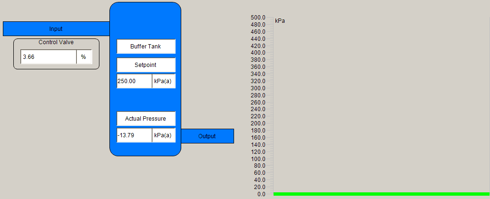

# 🛠️ Pressure Tank PID Control System

This project is a **control engineering simulation** of a pressure tank system with both **inlet and outlet flow dynamics**, developed using **TwinCAT PLC** software. The system uses a **PID controller** to regulate the pressure inside the tank by modulating the opening of an inlet control valve.

## 🎯 Project Objective

The goal is to simulate and visualize a closed-loop control system that maintains tank pressure at a target **setpoint** (250 kPa), using a PID controller acting on a simulated control valve.

---

## 📸 Demo



---

## 🧰 Features

- **PID Controller** to maintain tank pressure
- **Custom Function Blocks**:
  - `FB_ControlValve` – Simulates valve behavior based on a percentage open signal
  - `FB_PressureTransducer` – Simulates analog pressure readings
  - `FB_TankSimulation` – Models tank pressure based on inflow/outflow logic
- **SCADA Visualization**:
  - Live readouts of setpoint, actual pressure, and valve position
  - Real-time **trend chart** to monitor pressure over time
  - Animated control panel layout for better process understanding

---

## ⚙️ How It Works

- The **control valve** opening is driven by the output of the PID controller.
- The **inlet pressure** is proportional to the control valve’s opening percentage.
- The **outlet** is simulated as a constant or controlled disturbance.
- A **pressure transducer function block** reads the simulated tank pressure and feeds it back into the control loop.

---

## 📁 File Structure

```
Pressure-Tank-PID-Control/
│
├── TwinCAT/
│   ├── PID_Control_Project.tsproj   # Main TwinCAT project
│   ├── FB_ControlValve.TcPOU        # Control valve logic
│   ├── FB_PressureTransducer.TcPOU  # Pressure sensor logic
│   ├── FB_TankSimulation.TcPOU      # Process dynamics
│
├── SCADA/
│   └── Visualization elements and trend configuration
│
├── PID_Demo.gif                     # Demo animation for README
├── README.md                        # This file
```

---

## 🚀 Getting Started

To test or extend this simulation:

1. Clone the repository.
2. Open the `.tsproj` file with TwinCAT 3 in Visual Studio.
3. Download to a runtime or simulated PLC.
4. Monitor behavior through the integrated visualization.

---

## 📌 Future Ideas

- Add configurable disturbances
- Include a pressure relief valve function block
- Extend trend logging for data export
- Simulate fault conditions

---

## 🧑‍💻 Author

**Yasteer** – [GitHub](https://github.com/Yasteer)

---

## 📜 License

This project is licensed under the MIT License. Feel free to use, modify, or build on it.
